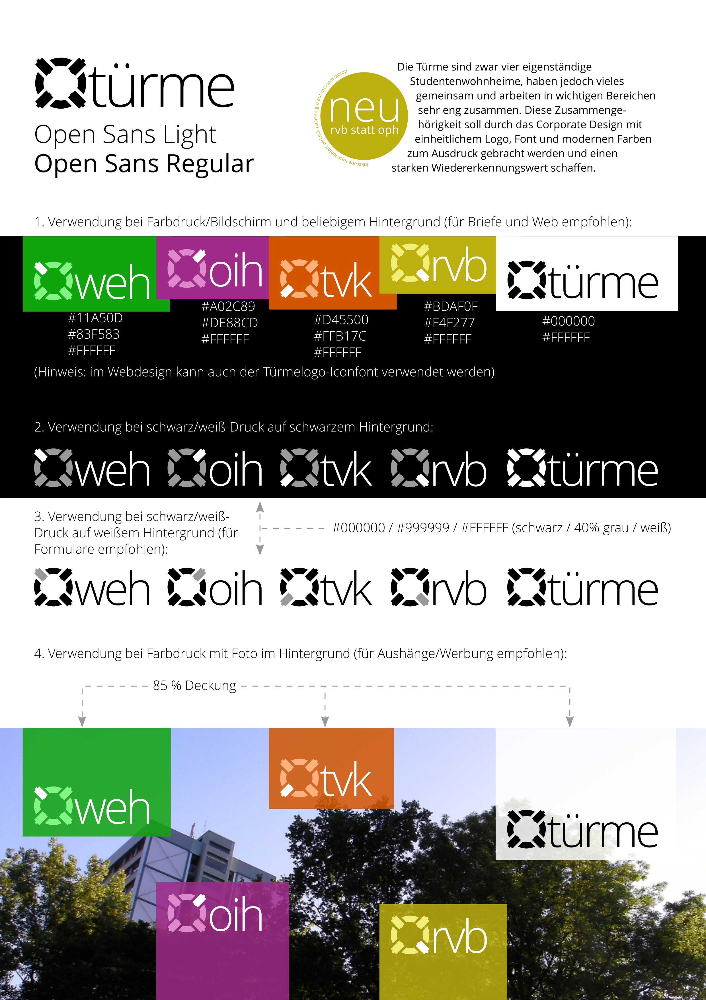

# Corporate Design für die Türme
## Sanierungsarbeiten
Achtung! In diesem Branch wird es aktiv umgebaut. Wir sind sehr dankbar an alle, die bisher am Design teilgenommen haben.

### Okay... aber warum?
Man merkt, dass die aktuellen logos irgendwie 10 Jahre alt sind. Es wäre auch gut bestimmte Details nachzubessern. Das OPH wird auch umbenannt.

### Goals
- Anpassbar an AGs und Co.
- Farbenversionen: Farbig auf weiß, Farbig auf Schwarz/Dunkelgrau, Farbig auf Hauptfarbe, Monochrom auf hellem Hintergrund, Monochrom auf dunklem Hintergrund
- Ausschiließlich ein Refresh: Die Recognition der bestehenden Logos muss auf die Neuen übertragbar sein

